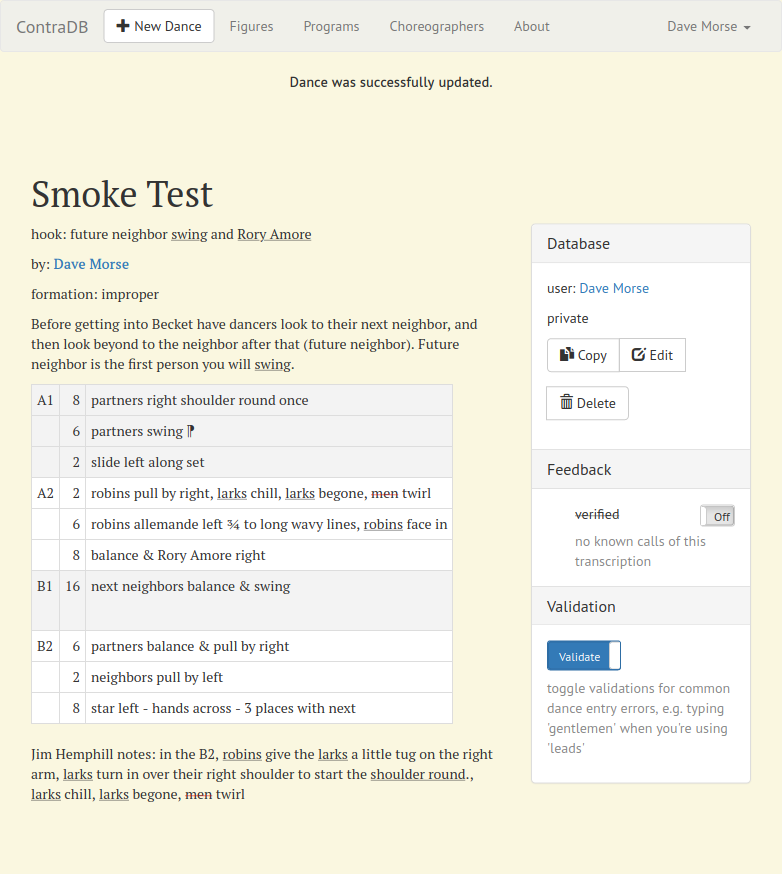

# Test Plan for Contradb

## Users
1. login works
   1. `signed in successfully` notification
   1. upper right corner menu changes
   1. search filter `verified` and `shared` options are enabled
1. logout
   1. `signed out successfully` notification
   1. search filter `verified` and `shared options` are disabled
   1. `new dance` redirects to login
1. create
   1. `sign up` menu item clicks
   1. `Public Data Handling` saves form values
   1. `No email` saves form values
1. edit
   1. verify form values from 'create'
   1. `Update Notifications` saves form values
   1. `Update Identity` changes pw
1. password reminder
   1. works `FAIL51`
   1. button looks okay `FAIL51`
1. admin user
   1. can see ~1535 dances when setting verified & not verified, and sketchbooks and private, versus ~1225 as unlogged-in user
   1. can edit & save another user's dance
   1. can edit choreographer
   1. edit choreographer Publish select has correct styling `FAIL`

## Dance Search

start while logged out

1. filters without login
   1. ~269 dances
   1. Title = "Baby" finds ~3 dances (The Baby Yoda, Becketize the Baby, The Baby Rose)
   1. Clear Filters clears out Title
   1. Choreographer "Hemphill" finds ~5 verified and ~32 all dances
   1. `Clear Filters` clears out Choreographer
   1. verified and not verified: ~1225 dances
   1. `Clear Filters` reverts to `verified` only.
   1. User "Gray" finds ~16 dances
   1. `Clear Filters` clears out user
   1. Hook "easy" finds ~7 dances
   1. `Clear Filters` clears out Hook
   1. not verified (only): ~954 dances
   1. verified & not verified at once: ~1161 dances
   1. `Clear Filters` clears out verification
   1. +sketchbooks adds ~2 dances
   1. `Clear Filters` clears out sketchbooks
   1. only check `becket`: ~87 dances
   1. `Clear Filters` clears out formations
1. filters with login (d_morse@_____.com user account)
   1. verified by me: ~3 dances
   1. not verified by me (only): ~1158 dances
   1. `Clear Filters`
   1. entered by me (uncheck shared): ~10 dances
   1. `Clear Filters`
   1. `logout`
1. SearchEx
   1. Figure > Any Figure: ~269 dances
   1. Figure > do si do: ~76 dances
   1. chain then hey: ~21 dances
   1. copy 'chain' and paste it onto 'hey', to make `chain then chain`: ~2 dances - `Clear Search` sends things back to Figure > Any Figure
   1. Figure > chain > who = gentlespoons = ~4 dances

## Dance View

1. go to dance 419 "Chance Dance Scrambled Eggs"
1. title = Chance Dance Scrambled Eggs
1. hook = "chainsow promenade to next neighbors"
1. by = Jim Hemphill
1. by-hyperlink works?
1. formation = improper?
1. 64 beats?
1. Zebra-striping per A1/A2/B1/B2?
1. thin grey borders on table cells
1. text and notes look like:

```
A1 	16 	neighbors balance & swing
A2 	8 	chainsaw promenade left
  	8 	chainsaw promenade back to the right
B1 	8 	gentlespoons allemande left 1½
  	8 	partners swing, end in a ring
B2 	8 	balance & petronella
  	4 	balance the ring
  	4 	partners California twirl ⁋

Cooked up with the breakfast crew.
Chance Dance, the All you can Eat Contra Dance Weekend
```

1. Database
   1. user Allison Jonjak
   1. shared everywhere
   1. Copy button prompts for login
      1. login to proceed
   1. Copy button goes to dance editor with the dance loaded (click back)
   1. navigate back to dance (back button doesn't work as I expect)
   1. `✔ verified (1)` badge
   1. toggle is off
   1. have text "1 user has called this transcription"
   1. temporarily toggle `off` -> `on`
      1. flash of clock icon instead of `✔`
      1. badge becomes (2)
      1. toggle is blue and says 'on'
   1. mailto link to datadactyl@somedomain.com (different on prod)
   1. click the mailto link
      1. subject is "contradb dance problem"
      1. body is "Dear datadactyl, I see a problem with  'Chance Dance Scrambled Eggs' (http://localhost:3000/dances/419) transcribed by Allison Jonjak. The problem is "
   1. toggle Validation off > on > off
      1. highlights `promenade` and `next neighbors` in preamble
      1. highlights `promenade` in A2
   1. dialect is tested elsewhere...

## Dialect Editor
Log in as d_morse@_____.com

1. "Dave Morse > dialect" looks okay
1. click "show..." button under Advanced & "Restore Default Dialect" button
1. "larks & robins" makes 8 entries
1. "Face to Face Turn for Two" "substitute" button and enter "%S shoulder round" makes a 9th entry
1. "substitute for a move"> "Rory O'More" makes a 10th entry. Set it to "Rory Amore" and blur the text field. The pencil icon should flash as a clock, then turn to a check.
1. click ContraDB in upper left corner to return to main search page.
1. search for "Rory Amore and shoulder round" and check 'not verified'
1. click "Going our Opposite Waves" by Jim Hemphill
1. A1 should start with "robins pull by right" and contain "Rory Amore right"
1. click "Copy"

## Dance Edit

The set-up to this is the Dialect Editor section above

1. change title from "Going Our Opposite Waves variation" to "Smoke Test"
1. change choreographer from "Jim Hemphill" to "Dave Morse". Tab complete around the word "Dave".
1. change the formation to "improper". Tab complete should be there.
1. click the first figure, and add a note of ", larks chill, gentlespoons begone, men twirl". Lingo lines should change the rendered text to underlinke "larks" and red-strikethrough "gentlespoons" and "men". Also check that the leading comma comes immediately after the word "chill".
1. in the notes, add the same text:  ", larks chill, gentlespoons begone, men twirl. There won't be any lingo lines, but the spellchecker might underline "gentlespoons".
1. Figures +Add a swing. It should pop in in the A1
1. on the C1 "partners swing", hit the ⋮ menu and "Add Progression". The ⁋ symbol should appear.
1. on the C1 "slide left along set", hit the ⋮ menu and "Remove Progression". The ⁋ symbol should disappear.
1. In the B2 click "star right 3 places with next", change the hand to left and the grip to "hands across".
1. Also in the B2 verify "partners right shoulder round once" appears
1. Remove the new "partners swing" in the A1
1. press 'Rotate' 3 times to pull the B2 into the A1
1. set Share to 'private'
1. Save Dance
1. toggle "Validate"



1. note the title of "Smoke Test"
1. note the underlined "swing" and "Rory Amore" in the hook.
1. note the by: Dave Morse. Does the link work?
1. note the "swing" in the preamble
1. note that "future neighbor" is not underlined in the preamble because contradb only recognizes the plural "neighbors".
```
A1 8 parnters right shoulder round once
   6 partners swing ⁋
   2 slide left along set
A2 2 robins pull by right, larks chill, larks begone, men twirl
```
Note the underlining of "larks" twice in the A2 line. "Gentlespoons" got translated to "larks"! FAIL but also probably WONTFIX. What if they change the word "swing" though? Note red line through "men".

1. at the end of the B2 look for "star left - hands across - 3 places with next"
1. note the many lingo lines in the notes (see image)
1. in the Database well, note that the user is Dave Morse and the word "private".

## Figures

This feature is scheduled for decommisioning, so don't worry too much about it.

1. click the figures tab. You should see a janky word cloud of figures.
1. click "swing". You should see a summary of dances with swings after some time (15 seconds?)

## Programs

1. Programs Index
   1. Click 'Programs' menu item leads to a huge list of programs
   1. Click '01.16.18-State College, Pa (band Smash the Windows)' by Karl Senseman
1. Programs View
   1. has a table of contents with hyperlinks.
   1. Click "Dean's Valentine" in the TOC and it jumps downpage to that dance
   1. "Dean's Valentine" entry says it's not published in red
   1. "Another Easy One" has dance figures
   1. "Another Easy One" introduces moves: down the hall, up the hall, right left through
   1. toggle validation and verify that lingo lines appear on "neighbors" in the last figure of The Baby Rose
   1. We could do more extensive testing of dialects here, but it uses
     the same code to render dances as dance show, so we rely on that
     testing.

1. Programs Editor
   1. this feature is scheduled for rewrite, and nobody's programming so I'm skipping the test regime for now.

## Choreographers

1. click "Choreographers" menu item
1. verify there's a big list of choreographers displayed.
1. click "Bob Crawford"
1. note "The Baby Yoda" appears as the only dance
1. click "New Dance"
   1. when prompted log in as an administrator
   1. verify that the new dance is by "Bob Crawford"
1. return to Bob's choreographer page.
1. click the "Edit Choreographer" button
   1. change name to Robert Crawford
   1. change the publish to "Always"
   1. Save Choreographer
   1. Note the changed name and the changed publish of Always
   1. Click through to The Baby Yoda and verify that his name changed there too.
   1. Click back
   1. click "Edit Choreographer" again and change everything back

## Online Documentation

1. About
   1. click "About" menu item
   1. read the text and think if it makes sense
   1. Verify that it mentions it's licensed under AGPL3
   1. AGPL3 licence hyperlink works
   1. source code hyperlink to github works
   1. click the "here's a little documentation" link to visit the ..
1. Help
   1. read the text and think if it makes sense
   1. is the contact information up-to-date?
   1. does clicking identities launch the mailer with the right To: address? (the one mentioned in mouseover, currently Dave)

## Preferences

Log in as whatever user

1. go to [User Name] > Account menu item
1. verify that Update Notifications saves the radio button values
1. verify that changing password works
1. verify that changing other Identity form values work
1. verify that deleting user from waaaaay back in User creation works
